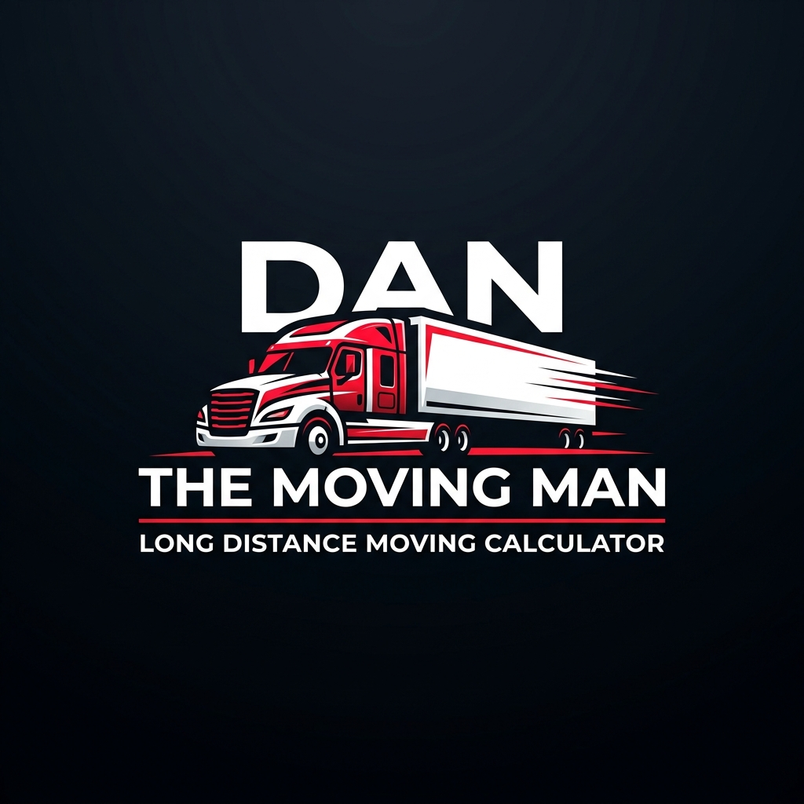

# DAN - THE MOVING MAN | Long Distance Move Calculator Portal



## Overview

**DAN - THE MOVING MAN** is a high-performance, automated long-distance moving quote calculation platform. Built for sales representatives, office managers, and admins, the system automates multi-variable logistics pricing formulas, converting manual calculations into standardized, instant customer quotes in under 2 seconds.

---

## 🌟 Key Features

- **Automated Route & Distance Engine**: Real-time driving distance (miles) and drive time (hours) calculation between any origin and destination.
- **Dynamic Truck Fleet Comparison**: Automatically compares rates between major truck rental providers (e.g. U-Haul vs. Penske) based on route mileage and required driving days, highlighting the cheapest option.
- **Logistics Schedule Calculator**:
  - Automatically calculates `Driving Days` based on an 11-hour/day maximum driver limit: $\lceil \text{Drive Hours} / 11 \rceil$.
  - Automatically computes required `Hotel Nights`: $\max(0, \text{Driving Days} - 1)$.
- **Multi-Variable Formula Engine**:
  - **Employee Driving Pay**: $\text{Distance} \times \$0.50/\text{mi} \times \text{Truck Count}$
  - **Fuel Expense**: $(\text{Distance} / \text{MPG}) \times \text{Gas Price} \times \text{Truck Count}$
  - **Hotel Accommodations**: $\text{Hotel Nights} \times \text{Hotel Rate} \times \text{Truck Count}$
  - **Loading & Unloading Labor**: $(\text{Loading Fee} + \text{Unloading Fee}) \times \text{Truck Count}$
  - **Flight Allowance**: Flat airfare return ticket allowance
  - **Subtotal & Profit**: $\text{Subtotal} + (\text{Subtotal} \times \text{Profit Margin \%})$
- **Printable Customer Invoice Modal**: Generates customer-ready estimates with print-optimized CSS (`@media print`) for instant printing or PDF saving.
- **Saved Quotes Directory & CRM**: Search, status filter (Draft, Sent, Accepted, Declined), duplicate, and export historical customer quotes to **CSV**.
- **Admin Configuration Panel**: Live controls for fuel rates, hotel fees, labor rates, driver pay, flight allowances, and profit margins with rule versioning.
- **100% Mobile & Tablet Responsive**: Sleek **Obsidian Black, Electric Red, and Pure White** design system tailored for phones, tablets, and desktops.

---

## 🛠 Tech Stack

- **Framework**: Next.js 16 (Turbopack, App Router)
- **Library**: React 19, TypeScript
- **Styling**: Tailwind CSS v4, Vanilla CSS design system
- **Icons**: Lucide React
- **Engine**: Client & Server Distance & Directions Calculation Service

---

## 🚀 Getting Started

### Prerequisites

- Node.js 18+ and `npm` installed.

### Installation

1. Clone or navigate to the project directory:
   ```bash
   cd movingcalculator
   ```

2. Install dependencies:
   ```bash
   npm install
   ```

3. Run the local development server:
   ```bash
   npm run dev
   ```

4. Open [http://localhost:3000](http://localhost:3000) in your browser.

---

## 📦 Production Build & Deployment

To create an optimized production build:

```bash
npm run build
npm run start
```

---

## 🔒 Configuration & Pricing Rules

Pricing rules and global variables can be modified directly in the **Admin Settings Panel** or persisted in `localStorage`. 

Updating global pricing rules locks existing saved quotes to preserve historic quote accuracy (Quote Versioning).

---

&copy; DAN - THE MOVING MAN. All rights reserved.
